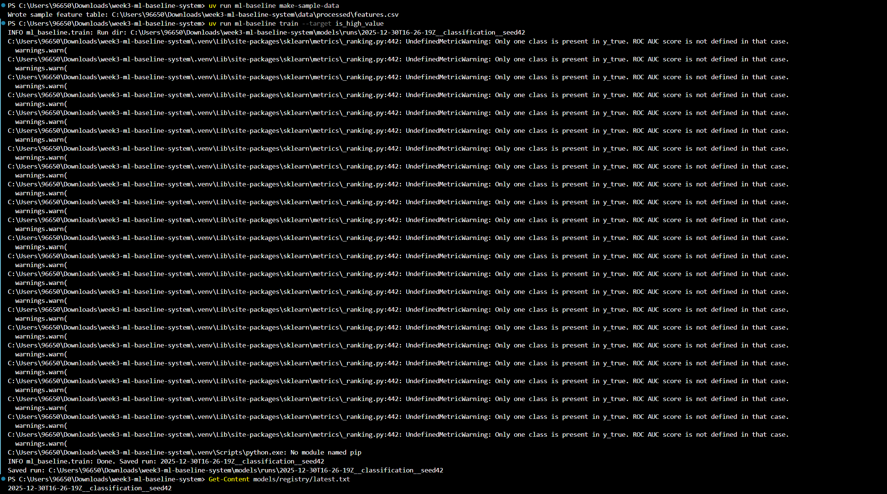
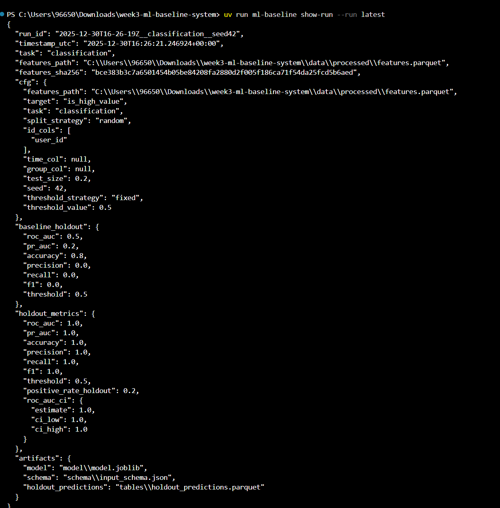
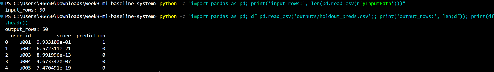
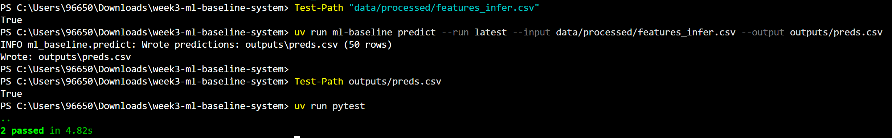
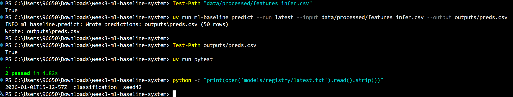
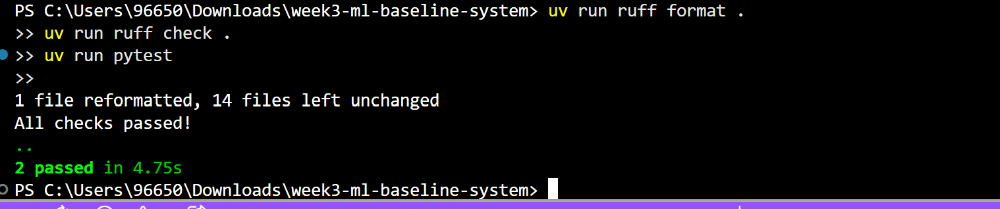

# Week 3 — Ship-Ready Baseline ML System (Train + Evaluate + Predict)

Turn a feature table into a **reproducible, CPU-friendly ML baseline** with:
- a training command that saves versioned artifacts, and
- a batch prediction command with schema guardrails.

This repo is designed to be:
- **offline-first** (no external services required),
- **reproducible** (run metadata + environment capture),
- **portfolio-ready** (clean structure + model card).

---

## Quickstart

### 1) Setup
```bash
uv sync
```

### 2) Create sample data (if needed)
```bash
uv run ml-baseline make-sample-data
```

This writes a small demo feature table to:
- `data/processed/features.csv` (and `.parquet` if available)

### 3) Train a baseline model
```bash
uv run ml-baseline train --target is_high_value
```

Artifacts are written to:
- `models/runs/<run_id>/...`
- `models/registry/latest.txt` points to the most recent run

### 4) Batch predict
```bash
uv run ml-baseline predict --run latest --input data/processed/features.csv --output outputs/preds.csv
```

### 5) Tests
```bash
uv run pytest
```

---

## What you submit
- working code (`src/`)
- passing tests (`tests/`)
- updated `reports/model_card.md` (filled in)
- updated `reports/eval_summary.md` (filled in)
- Model artifacts under `models/runs/<run_id>/`

See `architecture.md` for minimum requirements + stretch goals.

## How to run

### 1) Generate sample data
```bash
uv run ml-baseline make-sample-data
```

## Train the model

```bash
uv run ml-baseline train --target is_high_value
```
## Prepare inference input (remove target column)

```bash
Import-Csv "data/processed/features.csv" |
Select-Object user_id, country, n_orders, avg_amount, total_amount |
Export-Csv -NoTypeInformation "data/processed/features_infer.csv"
```
## Run prediction

```bash
uv run ml-baseline predict --run latest --input data/processed/features_infer.csv --output outputs/preds.csv
```

## Run tests

```bash
uv run pytest
```

## Artifacts
- Trained models and metadata: `models/runs/`
- Latest run pointer: `models/registry/latest.txt`
- Predictions output: `outputs/preds.csv`

## figures

## Images 1

## Images 2


## Images 3


## Images 4


## Images 5


## Images 6



